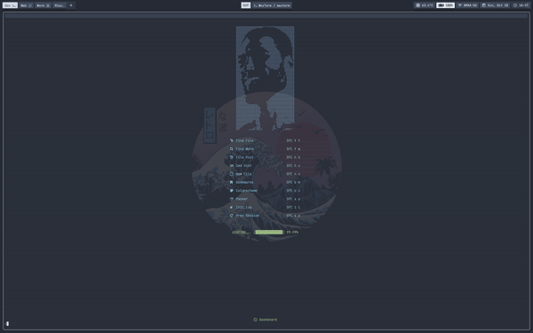

[](https://github.com/is0n/fm-nvim/stargazers/)
[](http://makeapullrequest.com)
[](https://github.com/is0n/fm-nvim/pulse)
[](https://github.com/is0n/fm-nvim/issues/)
[](https://github.com/is0n/fm-nvim/issues?q=is%3Aissue+is%3Aclosed)
[](https://github.com/is0n/fm-nvim/graphs/contributors/)
[](https://github.com/is0n/fm-nvim/blob/master/LICENSE)

# fm-nvim
`fm-nvim` is a Neovim plugin that lets you use your favorite terminal file managers from within Neovim. It's written in under **100 lines of pure Lua**.

* Supported File Managers
	* [Ranger](https://github.com/ranger/ranger)
	* [Xplr](https://github.com/sayanarijit/xplr)
	* [Vifm](https://github.com/vifm/vifm)
	* [Nnn](https://github.com/jarun/nnn)
	* [Lf](https://github.com/gokcehan/lf)

## Demo:


## Installation:
* [packer.nvim](https://github.com/wbthomason/packer.nvim):
	```lua
	use {'is0n/fm-nvim'}
	```
* [vim-plug](https://github.com/junegunn/vim-plug):
	```vim
	Plug 'is0n/fm-nvim'
	```
* [Vundle](https://github.com/VundleVim/Vundle.vim)
	```vim
	Plugin 'is0n/fm-nvim'
	```
* [NeoBundle](https://github.com/Shougo/neobundle.vim)
	```vim
	NeoBundle 'is0n/fm-nvim'
	```

## Configuration:
Change any of these values to suit your needs
```lua
require('fm-nvim').setup{
	-- Border around floating window
	border   = "none", -- opts: 'rounded'; 'double'; 'single'; 'solid'; 'shawdow'

	-- Percentage (0.8 = 80%)
	height   = 0.8,
	width    = 0.8,

	-- Command used to open files
	edit_cmd = "edit", -- opts: 'tabedit'; 'split'; 'pedit'; etc...

	-- Terminal commands used w/ file manager
	cmds = {
		lf_cmd     = "lf", -- eg: lf_cmd = "lf -command 'set hidden'"
		nnn_cmd    = "nnn",
		xplr_cmd   = "xplr",
		vifm_cmd   = "vifm",
		ranger_cmd = "ranger"
	}

	-- Mappings used inside the floating window
	mappings = {
		vert_split = "<C-v>",
		horz_split = "<C-h>",
		tabedit    = "<C-h>",
		edit       = "<C-e>"
	}
}
```

## Usage:
Any of the following commands are fine...
* Commands
	* `:Ranger`
	* `:Xplr`
	* `:Vifm`
	* `:Nnn`
	* `:Lf`

but you can add a directory path w/ the command...

Example:
```
:Lf ~/.config/nvim/
```

## Q&A
What if I want to open files in splits or tabs?
* Use any of the following mappings (unless you've changed them):
  * `<C-h>` for horizontal split
  * `<C-v>` for vertical split
  * `<C-e>` for normal edit
  * `<C-t>` for tabs

## TODO:
* High Priority
	* [ ] Replace Netrw
* Low Priority
	* [x] Add arguments to the commands (eg. directory path)
	* [ ] Add a tree like option

Any feedback, issues, or pull requests are greatly appreciated

<div align="center" id="madewithlua">
	
[](#madewithlua)
	
</div>
